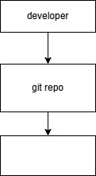
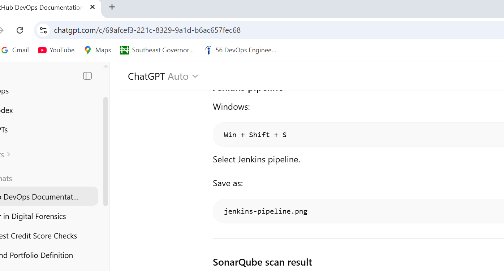

# Jenkins SonarQube Nexus CI/CD Pipeline

This project demonstrates a complete DevOps CI/CD pipeline using:

- Jenkins
- SonarQube
- Nexus
- Docker
- Kubernetes
- AWS

The pipeline automates:

1. Code build
2. Code quality scan
3. Artifact storage,
4. Docker image creation
5. Kubernetes deployment

## Architecture Diagram

---

## Jenkins Pipeline

---

## SonarQube Scan

